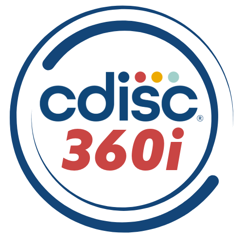

    

---

    

# Abstract #

CDISC 360i defines a vision and roadmap to enable standards-driven automation across the clinical research data life cycle - from study design to analysis. The purpose of these notebooks is to demonstrate the 360i Technical Roadmap by showcasing a strategy for research data pipeline automation using end-to-end, machine-readable standards metadata.

These notebooks automate study design using concepts and a standardized model to build a digital protocol. Aligned Case Report Forms (CRFs) and SDTM resources will be automatically generated as downstream artifacts using metadata from the digital protocol.

# Notebooks #

## Google Colab Notebooks
Currently, these notebooks are designed to execute in the [Google Colaboratory](https://colab.google.com/) environment.

|Notebook                                   |Notes
|-------------------------------------------|-------------------------------------------------------------------|
|CDISC_360i_Protocol_to_Submission          |* Shown at CDISC Interchange                                       |
|                                           |* Study artifacts stored on Colab filesystem (will not persist)    |
|                                           |* Development has stopped for this version                         |
|CDISC_360i_Object_Store_Automation         |* Study artifacts  Google MyDrive Object Store                     |
|                                           |* Requires Colab env setup for Google Drive                        |
|                                           |* Development will continue as new tools and features become available |

### How To ###

#### CDISC_360i_Protocol_to_Submission Notebook ####

1. Clone the repository or download notebook *CDISC_360i_Protocol_to_Submission.ipynb*
2. Access [Google Colaboratory](https://colab.google.com/) using your Google account
3. Open the CDISC_360i_Protocol_to_Submission notebook in Google Colab.
4. Follow the instructions in the notebook.

**Notes:**
* If you would like to access the OpenStudyBuilder API, you must supply an OSB_BEARER_TOKEN.
* A custom distribution of the CDISC CORE Rules Engine will be required for execution of CORE Validation Rules in the notebooks.  The Zip archive is downloaded when using the notebook. Releases of the CDISC Open Rules Engine is also available here:

    https://github.com/cdisc-org/cdisc-rules-engine/releases

    v0.13.0 is the supported version and the zip archive is named core-ubuntu-22.04-tarball.zip

#### CDISC_360i_Object_Store_Automation ####

1. Clone the repository or download notebook *CDISC_360i_Object_Store_Automation.ipynb*
2. Access [Google Colaboratory](https://colab.google.com/) using your Google account
3. Copy the *CDISC_360i_Object_Store_Automation.ipynb* notebook to Google Colab
4. Folow the instructions in the notebook.

**Notes:**
* A custom distribution of the CDISC CORE Rules Engine will be required for execution of CORE Validation Rules in the notebooks.  The Zip archive is downloaded when using the notebook. Releases of the CDISC Open Rules Engine is also available here:

    https://github.com/cdisc-org/cdisc-rules-engine/releases

    v0.13.0 is the supported version and the zip archive is named core-ubuntu-22.04-tarball.zip

# Resources #
**Other GitHub projects used in the notebooks**

|Project                            |GitHub Repository                                                                          |
|-----------------------------------|-------------------------------------------------------------------------------------------|
|Study Definition Workbench         |https://github.com/data4knowledge/study_definitions_workbench                              |
|Open Study Builder                 |https://gitlab.com/Novo-Nordisk/nn-public/openstudybuilder/OpenStudyBuilder-Solution       |
|Study USDM documents               |https://github.com/cdisc-org/360i/tree/main/data/protocol/LZZT/usdm                        |
|USDM validation utility            |https://github.com/pendingintent/cdisc-json-validation                                     |
|CDISC CORE Rules Engine            |https://github.com/cdisc-org/cdisc-rules-engine                                            |
|CRF creation                       |https://github.com/lexjansen/cdisc360i-pocs                                                |
|Trial Design Dataset creation      |https://github.com/pendingintent/cdisc-usdm-utils                                          |
|Define-XML template creation       |https://github.com/dostiep/360i                                                            |
|Define-XML creation                |https://github.com/swhume/template2define                                                  |
|Raw subject data                   |https://github.com/alidootson/UpdatedCDISCPilotData/tree/main/UpdatedCDISCPilotData/CDASH  |